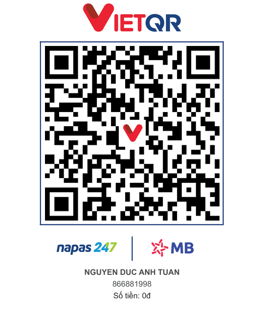

*English | [Tiếng Việt](README.vi.md)*

# cmt-speak

A desktop app (Windows/macOS) that reads live comments from **TikTok** and **YouTube**
livestreams out loud, using locally-synthesized Vietnamese speech via
[VieNeu-TTS](https://github.com/pnnbao97/VieNeu-TTS) — no data is sent to any server, and it
runs fully offline after the first model download. It helps streamers hear and react to
comments without constantly watching the chat overlay.

This is an **open-source** project, built and maintained in spare time. Any contribution —
code, issues, ideas, or financial support — is greatly appreciated; see
[Support the project](#-support-the-project) below.

## Features

- **Simultaneous TikTok Live + YouTube Live connections**, each platform can be toggled
  independently.
  - TikTok: just enter a username, no API key required.
  - YouTube: enter a live video URL/ID plus your own API key (YouTube Data API v3).
- **Natural Vietnamese text-to-speech**, synthesized locally with VieNeu-TTS (CPU/ONNX or
  GPU if available) — no dependency on paid third-party TTS services.
- **Voice cloning**: add a new reading voice from a 3–8 second audio sample, name it, and
  reuse it in later sessions; remove cloned voices when no longer needed.
- **Customizable reading template** with `{name}` and `{content}` placeholders, e.g.
  `"{name} asks: {content}"`.
- **Selectable audio output device**, including routing through a virtual audio cable
  straight into OBS.
- **Shared queue, no dropped comments**: both connectors push comments into a single FIFO
  queue, read sequentially in arrival order; the current queue length is shown live in the
  UI.
- **Comment filtering** (keyword blocklist) to avoid reading unwanted content.
- **Realtime log** showing every comment received, highlighting the one currently being
  read, with platform label and author name.
- A disconnect on one connector doesn't affect the other or the shared queue; errors (wrong
  API key, quota exceeded, video not live, etc.) are shown clearly in the UI.

## Architecture overview

```
TikTok Connector ──┐
                    ├─▶ Shared Queue (FIFO) ──▶ TTS Worker ──▶ VieNeu-TTS ──▶ Audio output
YouTube Connector ──┘                                │
                                                       ▼
                                                  PySide6 UI (log, controls, settings)
```

Design and implementation plan details (Vietnamese):

- [Overall design](docs/superpowers/specs/2026-09-09-cmt-speak-design.md) /
  [Implementation plan](docs/superpowers/plans/2026-09-09-cmt-speak-plan.md)
- [Quick controls, filter, reconnect design](docs/superpowers/specs/2026-09-09-quick-controls-filter-reconnect-design.md)
- [UI redesign design](docs/superpowers/specs/2026-09-09-ui-redesign-design.md)

## Requirements

- Windows or macOS.
- [uv](https://docs.astral.sh/uv/) and Python 3.12 (uv downloads Python automatically if
  missing).
- Network access on first run (to download the VieNeu-TTS model from Hugging Face) and
  whenever connecting to TikTok/YouTube to fetch comments. Subsequent runs don't need
  network access for speech synthesis.
- (Optional) A YouTube Data API v3 key if you want to read YouTube Live comments.

## Setup & run

```bash
uv sync
uv run python -m cmtspeak
```

## Running tests

```bash
uv run pytest -q
```

## Packaging (PyInstaller)

A shared spec file works for both Windows and macOS:
[packaging/cmt-speak.spec](packaging/cmt-speak.spec). Always build on the target OS itself
(no cross-compiling).

```bash
uv run pyinstaller --noconfirm packaging/cmt-speak.spec
```

- **macOS**: produces `dist/cmt-speak.app`, run it with `open dist/cmt-speak.app` or
  directly via `dist/cmt-speak.app/Contents/MacOS/cmt-speak`.
- **Windows**: produces `dist/cmt-speak/cmt-speak.exe` (the spec's BUNDLE step only applies
  to macOS; PyInstaller skips it automatically on Windows).

The first run on a new machine needs network access so VieNeu-TTS can download its model
from Hugging Face; later runs work fully offline (aside from connecting to TikTok/YouTube
to fetch comments).

## Contributing

Contributions are welcome:

1. Fork the repo and create a branch for your change.
2. Run `uv run pytest -q` before committing to make sure existing tests still pass.
3. Open a Pull Request describing the problem and your solution.

Found a bug or have a feature idea? Please open an
[Issue](https://github.com/tuannda98/TTS_LiveComment/issues) on GitHub.

## 💛 Support the project

cmt-speak is a free, open-source project built outside of work hours. If it's useful to you
— especially if you're a streamer using it live — a small show of support goes a long way
toward keeping it maintained and growing:

- ☕ **Buy Me a Coffee**: [buymeacoffee.com/mrt198](https://buymeacoffee.com/mrt198)
- 💳 **PayPal**: [paypal.me/mrt198](https://paypal.me/mrt198)
- 🏦 **Bank transfer (Vietnam)**: MBBank — Account `866881998` — Account holder
  `NGUYEN DUC ANH TUAN`

  

  *(Scan with any Vietnamese banking app that supports VietQR/Napas 247)*

Every bit of support, no matter how small, is deeply appreciated. Thank you for using and
supporting this project!
